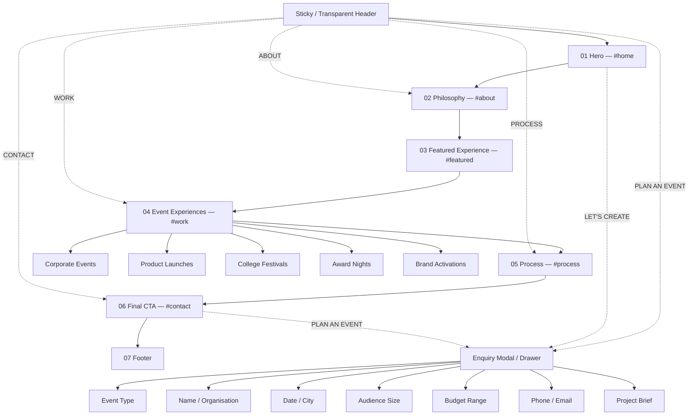
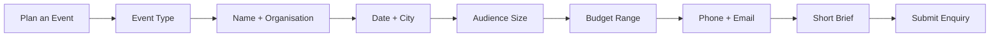

# CHANDRA — One-Page Site Map

## Product Model
Chandra is a **single-page scroll website**. Navigation items are anchors, not separate pages.

## Visual Site Map

## Navigation
Desktop header:
- CHANDRA logo → `#home`
- ABOUT → `#about`
- WORK → `#work`
- SERVICES / PROCESS → `#process`
- CONTACT → `#contact`
- PLAN AN EVENT → enquiry modal

Recommended final nav labels:
`ABOUT | WORK | SERVICES | PROCESS | CONTACT`

If fewer items are preferred, merge SERVICES + PROCESS and use:
`ABOUT | WORK | PROCESS | CONTACT`

## Scroll Sequence

### 01 Hero — `#home`
- Cinematic event-video background
- Brand promise
- Primary CTA

### 02 Philosophy — `#about`
- “More Than Events”
- Short brand explanation
- Production/event image

### 03 Featured Experience — `#featured`
- One flagship project
- Scale / proof points
- Case-study CTA

**Single-page behavior:** case-study CTA may open an overlay/lightbox with 3–6 project images and concise facts. Avoid navigating to a separate page in phase 1.

### 04 Event Experiences — `#work`
- Corporate Events
- Product Launches
- College Festivals
- Award Nights
- Brand Activations

Card interaction options:
- Hover: media zoom + label shift
- Click: filtered project overlay, gallery modal, or no click for MVP

### 05 Process — `#process`
`Concept → Design → Produce → Manage → Deliver`

### 06 Final CTA — `#contact`
- Cinematic finale media
- Primary enquiry CTA

### 07 Footer
- Contact details
- Social links
- Legal

## Enquiry Modal Structure

## URL Model
Because this is a single page:
- `/` — website
- `/#about`
- `/#featured`
- `/#work`
- `/#process`
- `/#contact`

Optional later:
- `/privacy`
- `/terms`

Keep the marketing experience on one page unless real content volume later justifies a dedicated portfolio system.
