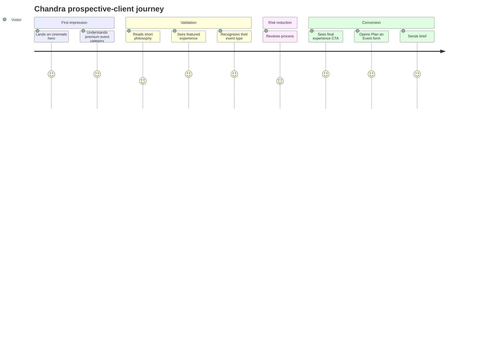

# CHANDRA — UI/UX Design Brief

## 1. Design Challenge
Create a one-page event-company website that feels as premium and immersive as a live production while remaining clear enough for a corporate buyer to understand quickly.

The site should not behave like a traditional brochure. It should feel like a **controlled sequence of reveals**.

## 2. North-Star Experience
**“From anticipation to impact.”**

The first viewport should feel like the lights are about to come on. As the visitor scrolls, Chandra reveals its thinking, work, range, process, and finally invites the visitor to create the next experience.

## 3. Audience Mindset
Visitors are usually scanning for proof, not reading every word.

They need immediate answers:
- Is this premium?
- Do they handle my event type?
- Can they handle scale?
- Do they understand production?
- Can I trust them?
- How do I contact them?

## 4. Experience Principles

### Principle 1 — Show before explaining
Use event media as proof. Text supports the image; it does not compete with it.

### Principle 2 — One message per section
Avoid dense service lists or paragraph-heavy blocks.

### Principle 3 — Luxury through restraint
Premium = whitespace, pacing, hierarchy, image quality, typography, and motion discipline.

### Principle 4 — The website itself should feel produced
Transitions, lighting, spacing, and sequencing should feel intentional in the same way an event run-of-show feels intentional.

### Principle 5 — Conversion remains visible
The cinematic experience cannot hide the commercial goal. `PLAN AN EVENT` must always be easy to find.

## 5. Core User Journey

## 6. Header UX
### Desktop
- Transparent over hero
- Logo left
- Nav right/center
- Primary CTA far right
- On scroll: background becomes slightly opaque near-black with subtle blur only if needed for readability

### Mobile
- Logo left
- Menu icon right
- Full-screen dark menu
- Keep `Plan an Event` as the strongest action

## 7. Hero UX
- Background video begins muted and inline
- Headline is readable before video finishes loading
- Use poster image as immediate fallback
- Text overlay is HTML, never baked into video
- No carousel
- No intro splash screen
- No forced “click to enter”

## 8. Philosophy UX
Use a quiet visual change after the high-energy hero. The warm-ivory section functions as a breathing moment.

Keep copy intentionally short.

## 9. Featured Experience UX
This section should feel like proof, not another marketing statement.

Prioritize:
- project name
- event type
- one sentence
- 3–4 verifiable facts
- media

If a case-study overlay is implemented, keep it lightweight and dismissible without losing scroll position.

## 10. Event Experiences UX
Cards should answer “Do they handle my kind of event?” in under 3 seconds.

Desktop interaction:
- image scale 1.00 → 1.04
- label rises 4–6 px
- optional gold rule expands

Mobile:
- horizontal scroll-snap
- partial next card visible as affordance
- no hover-dependent information

## 11. Process UX
Keep process simple and reassuring:
`Concept → Design → Produce → Manage → Deliver`

This is not a detailed workflow explanation. It communicates ownership and continuity.

## 12. CTA UX
Use the strongest emotional image at the end.

CTA opens a modal/drawer instead of loading a new page.

Form design:
- 1 column mobile
- 2 columns desktop where appropriate
- labels always visible
- clear required fields
- no more than 8–9 inputs
- optional project brief textarea

## 13. Interaction Language
- Easing: smooth, physical, premium
- Avoid bouncy/springy UI
- Hover feedback: 180–300 ms
- Scroll-driven media motion: 600–1200 ms perception window
- Use `cubic-bezier(0.22, 1, 0.36, 1)` for many reveals

## 14. Accessibility
- Minimum 44×44 px touch targets
- Visible keyboard focus
- AA contrast for labels/body
- Modal focus trap
- Reduced-motion state removes parallax and complex reveals
- Do not rely on gold alone to indicate active/interactive states

## 15. Responsive Philosophy
Do not simply shrink desktop.

### Mobile changes
- Hero text moves lower in viewport
- Event gallery becomes horizontal snap carousel
- Process becomes vertical or 2×3 grid
- Large media crops are re-authored for portrait
- Parallax intensity reduced drastically
- Navigation becomes full-screen menu

## 16. Content Tone
- Short
- Confident
- Visual
- Human
- No corporate jargon overload
- No exaggerated claims without proof

Preferred language:
- “More Than Events”
- “Ideas on a Bigger Stage”
- “Every Event. A New Story”
- “Experiences People Never Forget”

## 17. Reference-Site Usage Rule
The provided websites are useful for understanding:
- the categories event buyers look for,
- the importance of showing real work,
- proof/trust expectations,
- and clear enquiry pathways.

They are **not** UI templates. Chandra must retain the approved original design language.
